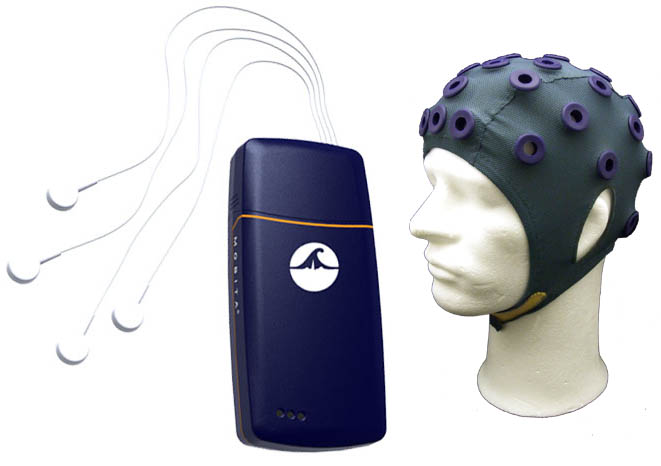
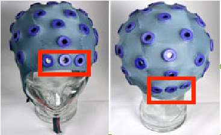

**Set-up the TMSi Mobita**

_Figure 1. Mobita equipment._

Material:

- --32-electrode cap/10-electrode head-wrap
- --32 or 10-electrode set
- --wristband
- --32 or 10 sponges
- --water
- --syringe
- --amplifier
- --(Wifi-dongle, when using Windows)

Prepare the cap:

- --rol up the sponges and put one inside each electrode
- --wet the sponges and wristband using water and the syringe
- --connect the electrodes to the amplifier
- --click the green electrode (the one with the long wire) on the wristband

Connect the Mobita to the computer:

- --check if the blue light is on on the amplifier
- --(when using Windows, you can plug in the wifi dongle and turn off your wifi)
- --go to your wifi connections and look for a wifi network called MobitaXXXXXXX. The X's denote the last 7 digits of the number specified on a sticker on the back of the amplifier. Each Mobita amplifier has a specific number, be sure to connect to the correct one.
- --Connect to the Mobita network. You are asked for a password: MOBITAXXXXXXX. Again the X's denote the last 7 digits of the number that is on a sticker on the back of the amplifier. For instance, if the number on the sticker is 070120008, your password will be MOBITA0120008.

Fit the cap to your subject:

 
          front                   back

Figure 2. Cap fitting.

- The cap should not be to tight and definitely not to loose. You can recognize the front of the cap by the fact that the three electrodes in the middle section of the cap are the closest to the border of the cap (see the three rubber holes in red in Figure 2).
- Place the electrodes in the rubber holes on the cap according to the 10/20 International System or according to your own configuration.
- Press all electrodes slightly so the water runs out of the sponge and through the hair underneath, thereby creating a little bridge of water to connect the scalp to the electrode. Make sure that the subject's head does not get completely wet, in that case the electrodes will all be connected and measure the same signal.
- Place the wristband around the subject's wrist.
- Check the EEG signal. If all channels have a bad signal, check if the wristband is well connected and wet. If particular channels have a bad signal, check whether they stick out of the rubber hole, try to move some hair out of the way and make sure the sponge inside the electrode is wet.

